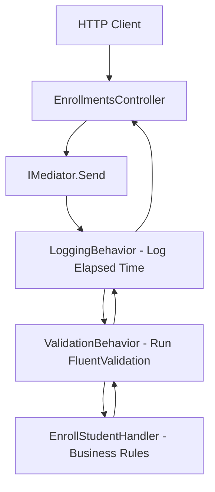

# In-Depth Guide: Session 1 Exercise 2 & Architecture

This guide explains the architecture of Session 1 Exercise 2, how the components work together, the engineering rationale behind their design, and a detailed summary of the fixes we applied to compile and run the solution.

---

## 🏗️ 1. Architecture Overview (CQRS & MediatR)

### What is CQRS?
**CQRS** stands for **Command Query Responsibility Segregation**. It separates read operations (Queries) from write operations (Commands). 

* **Commands** (e.g., `EnrollStudentCommand`): Represent intent to change state. They carry a payload and return a domain Result indicating success or a specific failure reason.
* **Queries** (e.g., `GetStudentScheduleQuery`): Represent intent to retrieve data. They are lightweight, bypass complex domain checks, and map directly to Data Transfer Objects (DTOs) like `ScheduleDto`.

### Why Segregate?
In traditional architectures, a single service handles both reads and writes. This leads to:
1. **Bloated Services**: Large files containing hundreds of lines of mixed code (validation, auth, EF queries, business rules).
2. **Fragile HTTP Contracts**: The controller exposing endpoints is tightly coupled to the database model. Any schema change risks breaking external API integrations.
3. **Harder Testing**: Testing a small business rule requires mocking a large service with dozens of unrelated database operations.

In CQRS with MediatR:
* The API Controller is **thin**. It only acts as an HTTP router (dispatches a request to MediatR and maps the response).
* The Business Logic is **modular**. Each command and query has its own self-contained handler file that does exactly one thing, making it highly testable and readable.

---

## 🛠️ 2. Architectural Patterns Used in Exercise 2

### 1. The Result Pattern (`Result<T, E>`)
Traditional code often uses exceptions (e.g., throwing a `CourseFullException`) to handle business rule violations. 

#### Why Result instead of Exceptions?
* **Performance**: Throwing exceptions is resource-heavy because the runtime has to capture the entire call stack.
* **Semantics**: Exceptions are for *unexpected* system failures (e.g., database connection loss, disk out of space). A course being full is a *predicted and normal* business flow outcome.
* **Safety**: If a method returns `bool` or throws exceptions, the compiler cannot force the caller to handle the failure. With `Result<TValue, TError>`, the caller is forced to inspect `IsSuccess` or call `Match()` to access the value, preventing unhandled runtime branch bugs.

#### Engineering Choice: `readonly record struct`
* Being a **value type** (`struct`), it does not allocate memory on the heap, keeping the garbage collector idle.
* The `readonly` keyword prevents accidental side-effects (mutating results after they are returned).

---

### 2. Pipeline Behaviors (Logging & Validation)
Cross-cutting concerns (logging, validation, audit trails) should not live inside business handlers. If every handler had `try/catch`, `LogInformation()`, and `if (studentId < 0) ...` blocks, the code would be cluttered.

**MediatR Pipeline Behaviors** act like ASP.NET Core middleware, but they run inside the Application layer:

#### Order of Registration
In [Program.cs](file:///d:/ab/C%23/TmsApi/TmsApi.Api/Program.cs), the order is:
1. `LoggingBehavior`
2. `ValidationBehavior`

If a validation check fails, `ValidationBehavior` throws a `ValidationException`. Because `LoggingBehavior` was registered first, it wraps the validation middleware. The exception is caught in the `catch` block of `LoggingBehavior`, writing a structured "Failed request" log containing the correct **Correlation ID** before propagating up to the exception handler middleware.

---

### 3. Global Exception Handling (`IExceptionHandler`)
When a validator throws a `ValidationException` (or a database failure throws an unexpected exception), we do not want raw stack traces leaking to the API client. 

`GlobalExceptionHandler` captures these exceptions globally and transforms them into an **RFC 7807 ProblemDetails** JSON response. 
* It returns HTTP `400 Bad Request` with field-specific errors for validation failures.
* It returns HTTP `500 InternalServerError` with a clean message and a **Trace ID** for unexpected exceptions, keeping the application secure.

---

## ✏️ 3. What Changes We Made and Why

We modified the codebase to bridge the gap between the application layer handlers and the database operations:

### 1. Updated `ICourseService`
* **Change**: Changed `GetByCodeAsync` to return the domain `Course` entity containing `Enrollments`, rather than `CourseResponseDto?`.
* **Why**: The `EnrollStudentHandler` needs access to the live `Course.Enrollments` collection to check whether the course has reached `MaxCapacity` before creating a new enrollment. A DTO representation does not contain navigation properties.

### 2. Added methods to `IEnrollmentService`
* **Change**: Added `ExistsAsync`, `AddAsync`, and `GetByStudentIdAsync` declarations.
* **Why**: The application handlers require checking if a student is already enrolled (`ExistsAsync`), persisting a new enrollment record (`AddAsync`), and retrieving a student's schedule by ID (`GetByStudentIdAsync`).

### 3. Implemented Infrastructure Services
* **[CourseService](file:///d:/ab/C%23/TmsApi/TmsApi.Infrastructure/Services/CourseService.cs)**: Implemented EF query using `.Include(c => c.Enrollments)` to fetch the Course with its associated enrollments in a single database roundtrip.
* **[EnrollmentService](file:///d:/ab/C%23/TmsApi/TmsApi.Infrastructure/Services/EnrollmentService.cs)**:
  * Implemented `ExistsAsync` using `db.Enrollments.AnyAsync` checking both student ID and course code.
  * Implemented `AddAsync` to insert records to the database.
  * Implemented `GetByStudentIdAsync` using `.Include(e => e.Course)` to eagerly load course codes and titles for DTO mapping in queries.

### 4. Corrected API & Queries Errors
* **[V2 EnrollmentsController](file:///d:/ab/C%23/TmsApi/TmsApi.Api/Controllers/V2/EnrollmentsController.cs)**: Fixed a syntax error in the `onFailure` switch expression so that default cases return a standard BadRequest Problem.
* **Namespace Scoping**: Placed controllers under V1 and V2 namespace scopes. Without namespaces, ASP.NET Core encounters a duplicate class declaration error in the global namespace and refuses to build.
* **[GetStudentScheduleHandler](file:///d:/ab/C%23/TmsApi/TmsApi.Application/Enrollments/Queries/GetStudentScheduleHandler.cs)**: Corrected the placeholder list projection to map actual `Course.Code`, `Course.Title`, and a schedule payload rather than empty strings.
